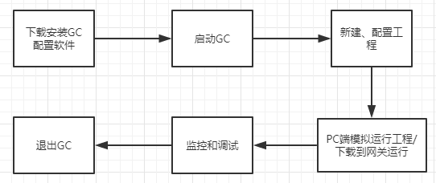
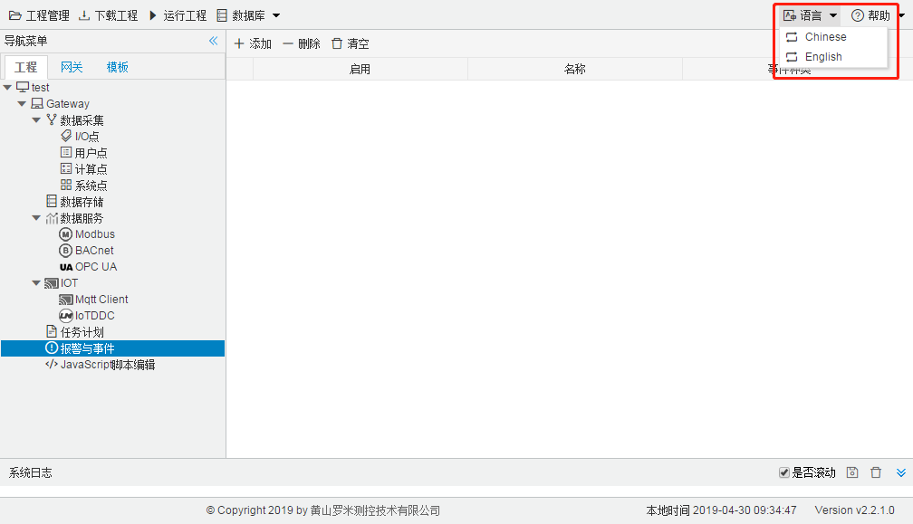
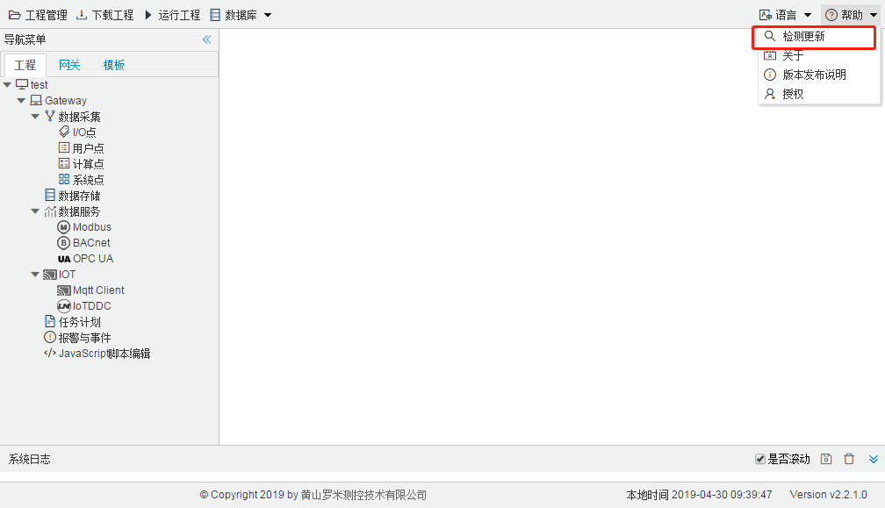

# 概述

## GC使用步骤

GC运行流程

## GC 安装/卸载

GC配置软件可在罗米官网http://www.lmgateway.com/免费下载，可稳定运行在Windows XP/ Windows  7/Windows 10系统下。

**安装**

右键“以管理员身份运行”安装包中的LM_GateWay_Setup.exe，选择安装的路径。

注意：window10由于安全策略的问题，不能把软件安装在C盘（系统盘）下。

**卸载**

双击安装目录下的uninst.exe，按照卸载步骤即可完成GC的卸载。

## 环境切换

GC配置软件集成了中文、英文两种语言环境，用户可以根据需要在GC语言工具栏中选择相应的语言环境。

语言

## GC在线升级

罗米官网会不定期的发布新版GC配置软件，用户可以通过在官网下载最新版或者通过老版本中的在线升级功能直接升级到最新版。

注意：在线升级时请保持电脑连接互联网。

在线升级

