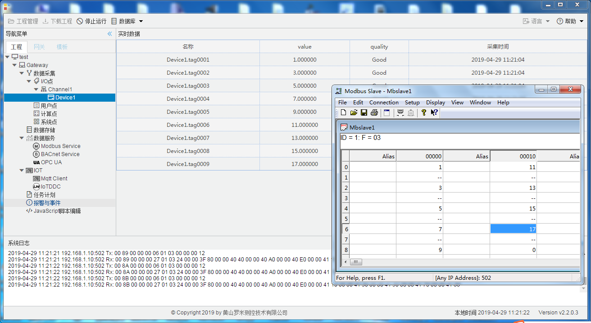

# 第十章 运行工程

工程配置完成之后，用户可以选择在PC端运行工程：点击工具栏当中的“运行工程”按钮，此时就会在电脑上根据当前工程进行数据采集和数据服务。在系统日志栏中会打印程序运行时输出的日志和报文，便于调试。 

在软件网关运行时，可以通过点击通道下的设备进行查询设备下所有点的实时数据。 

图10-1 软件网关运行时

工程配置完成之后，用户也可以选择将该工程通过工具栏中的"下载工程"按钮将工程下载到LMGateway当中运行。在下载成功之后，LMGateway网关会重启程序，立即运行新下载的工程。