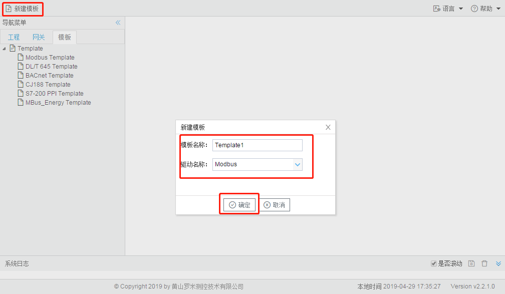
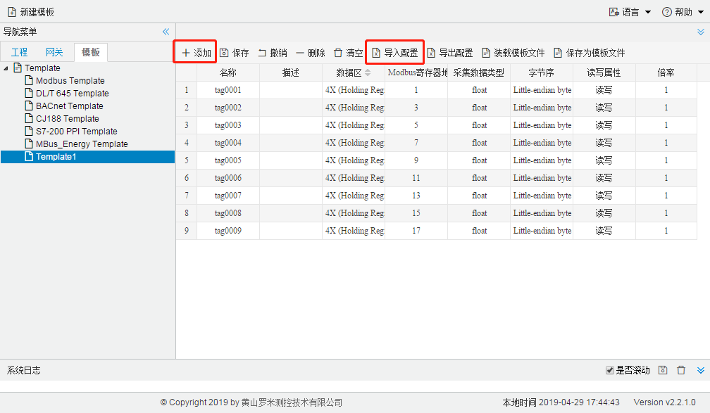
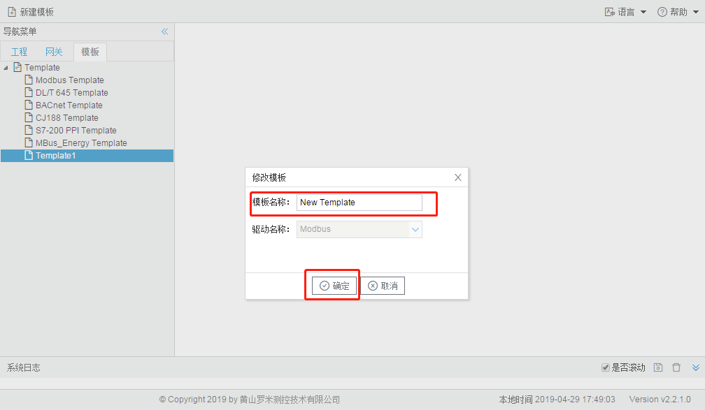
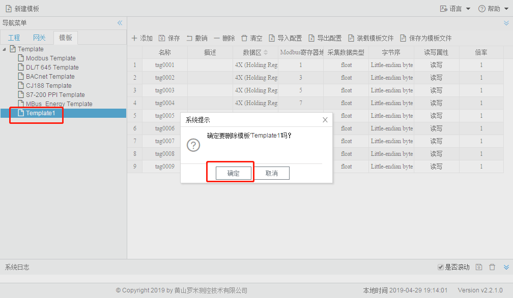

# 第十一章 模板

Gateway Configuration具有保存模板和装载模板的功能，目的是便于用户在配置相似或相同的采集设备时减少操作。

## 11.1 新建模板

点击工具栏中的“新建模板”按钮，在弹出框中填写不重复的模板名称，选择模板的驱动协议。

图11-1 新建模板

单击左侧模板树中刚才新建的模板，通过“添加”按钮一个一个Tag点的添加或者通过在Excel中编写完成之后“导入Excel”，就完成了一个模板的新建，在工程页面可以通过“装载模板文件”的按钮装载各个模板，简化配置工程的步骤。

图11-2 编辑模板

## 11.2 修改模板名称

双击需要修改名称的模板，在弹出框中修改模板名称，点击“确定”按钮。

图11-3 修改模板名称

## 11.3 删除模板

单击选中需要删除的模板，右键选择“删除模板”。

图11-4 删除模板

