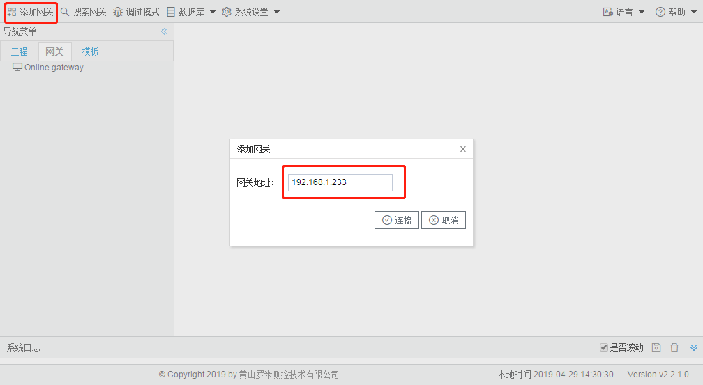
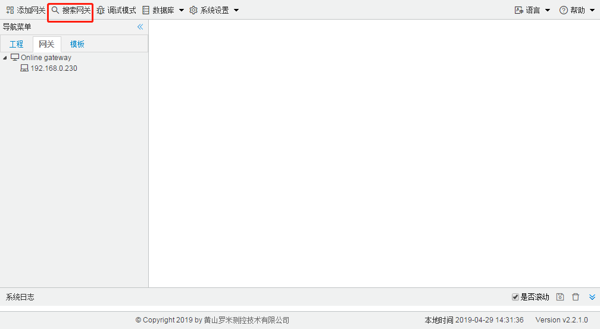
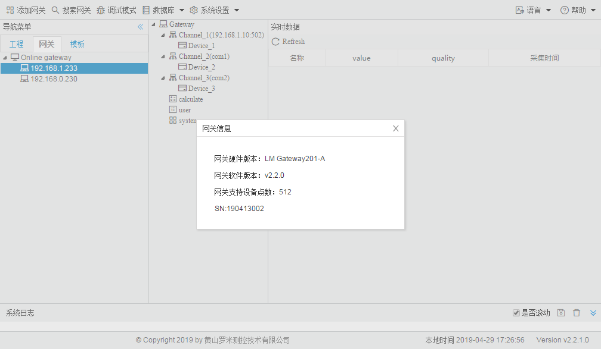

# 2.2 添加、搜索、查看网关

**添加网关** 

如果你知道网络中LMGateway的IP地址，那么你可以通过添加设备的方式将此设置添加到在线设备列表中。 

图2-3 添加网关

**搜索网关** 

将网络中的LMGateway全部搜索并列到Online gateway列表中。

图2-4 搜索网关

**查看网关信息** 

双击需要查看信息的网关IP，在弹出的窗口中包含网关的硬件版本、软件版本、支持点数和SN号，其中支持点数是指网关中的数据点低于支持点数时可以保证网关的运行效率。

图2-5 查看网关信息

