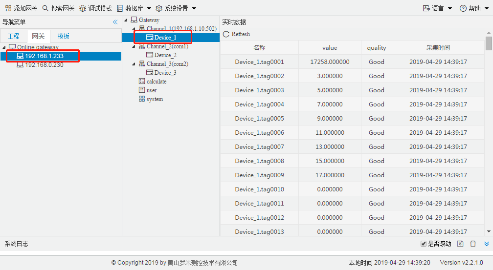
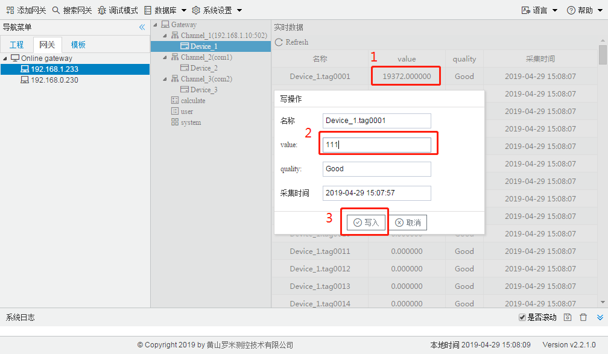

# 2.3 实时数据、设置Tag点值

**查看实时数据**

Gateway Confifiguration具有监控LMGateway数据的功能，单击需要监控的网关的IP，就会在右侧显示通过 HTTP接口查询到的所有实时数据，可以通过点击左侧的通道设备树节点来查看单一的通道或者设备的数据。 

图2-6 实时数据

实时数据分为名称、value、quality、采集时间，分别如下：

- 名称：Tag点在当前LMGateway中的唯一标识。
- value：此时Tag点的实时值。
- quality：Tag点的质量戳，Good表示采集成功，此时value显示采集到的值；Error为采集失败，此时value显示为空。

**设置Tag点值**

Gateway Confifiguration可以通过HTTP协议对网关下面的采集设备进行写操作。 

在实时数据页面，单击需要写入的Tag点的value，在弹出的窗口中输入需要写入的value，之后点击“写入”按 钮。

图2-7 设置Tag点值

