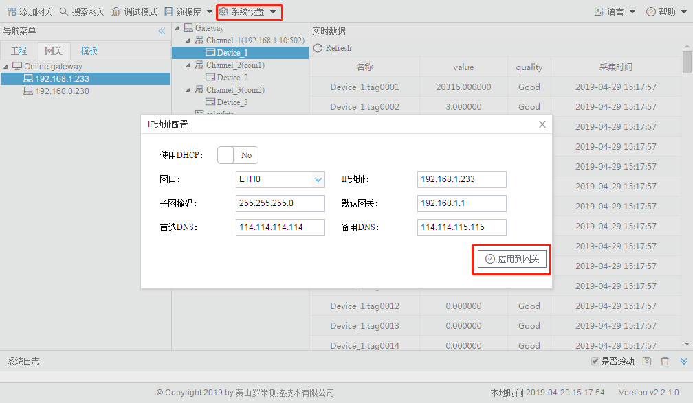
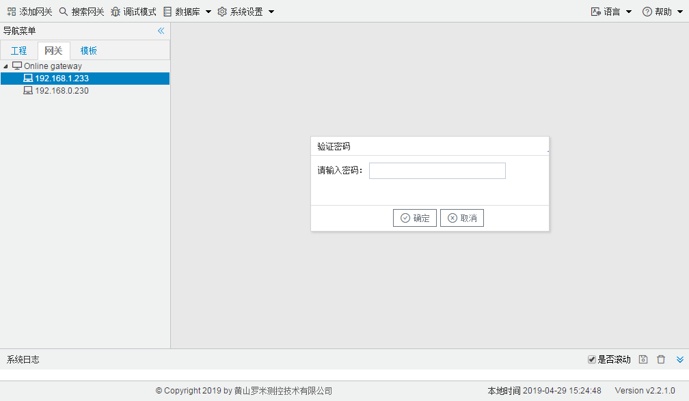
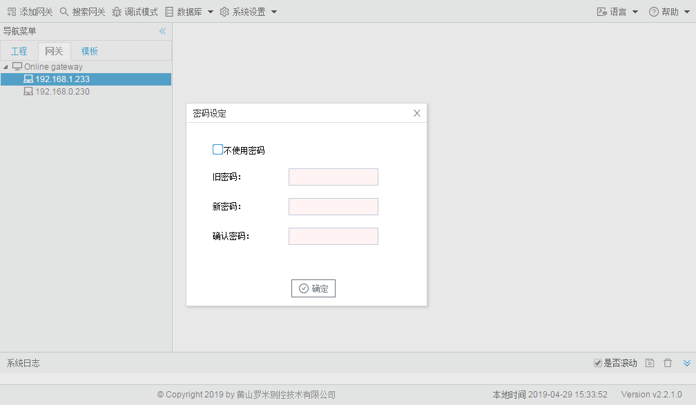
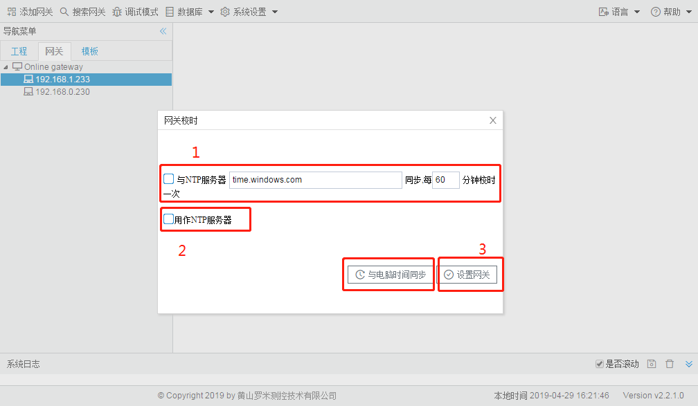
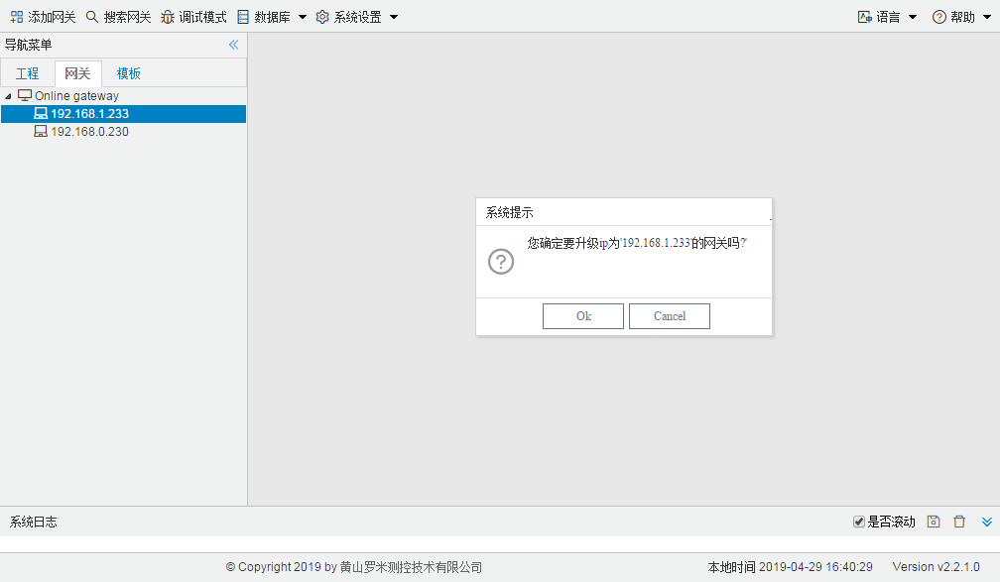

# 2.4 系统设置

## 2.4.1 设置IP

用户可以通过Gateway Confifiguration修改在线LMGateway网口的IP地址和DNS，也可以设置网口为DHCP。 

点击“应用到网关”按钮之后，网关会马上应用当前配置的IP。

图2-8 设置IP

## 2.4.2 上载工程

Gateway Confifiguration可以将当前网关的配置文件上载到本地。 

点击“上载工程”时，为防止工程被他人上载，如果当前网关使用了密码，在上载工程时会需要用户输入密码之后才能进行上载工程的操作。

图2-9 上载工程

上载工程成功后GC会自动打开上载的工程。

## 2.4.3 密码设定

LMGateway网关出厂默认没有设置密码，用户出于安全的考虑可以给网关设置密码，密码需要用户自己记录。

图2-10 密码设定

## 2.4.4 网关校时

- 使网关根据设定的周期与NTP服务器同步时间 
- 将网关时间同步成电脑时间 
- 将网关设置为一个时间同步源，其他设备可以与这台网关同步时间

图2-11 网关校时

如果只需要将网关时间与电脑时间同步，只需要点击“与电脑时间同步”按钮； 

如果需要设置上图中的1、2，设置好之后需要点击“设置网关”按钮。 

## 2.4.5 重启网关

Gateway Confifiguration可以通过HTTP接口对网关进行重启。

图2-12 重启网关

## 2.4.6 网关升级

建议用户不要随意点击，需要进行网关升级时请先联系厂家。 

在升级过程中请不要操作Gateway Confifiguration和网关，在升级结束时会在系统日志中输出相应的信息。

图2-13 网关升级

