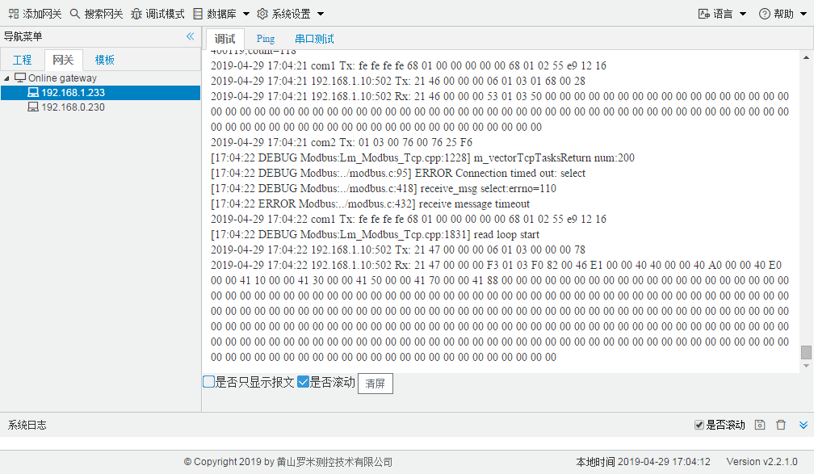
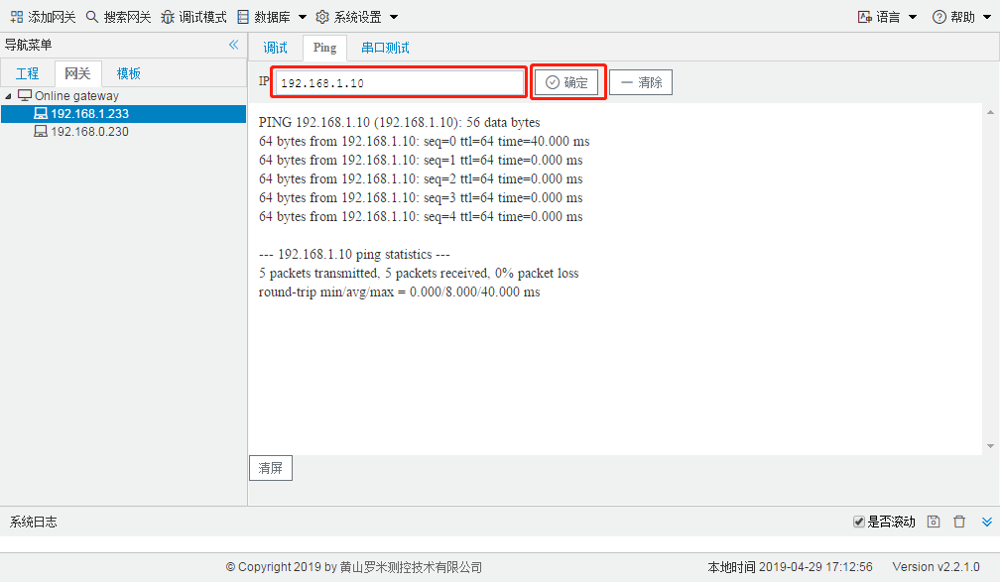
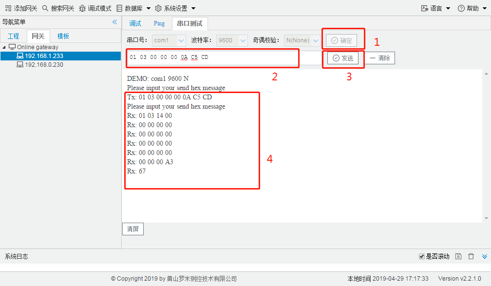

# 2.5 调试模式

用户通过点击工具栏中的“调试模式”按钮进入调试模式。 

Gateway Confifiguration的调试模式分为三部分：网关数据采集日志和报文输出、网关Ping测试、网关串口测试。 

## 2.5.1 网关数据采集日志和报文输出

用户可以通过调试模式查看网关在运行过程中交互的报文，便于遇到通讯出错时找出问题。

图2-14 网关数据采集日志和报文输出

## 2.5.2 Ping测试

用户通过输入需要网关ping的IP，点击“确定”按钮即可使网关进行ping操作。(默认进行5次ping操作，5次之后停止)，在点击“确定”之后网关就会结束采集进程，需要点击“调试”选项卡或者重启网关使网关根据工程文件进行采集和服务。

图2-15 Ping测试

## 2.5.3 串口测试

用户可以通过串口测试发送指定的报文，查看是否有返回的报文或返回的报文是否出错，验证串口配置和接线是否正常。

图2-16 串口测试

