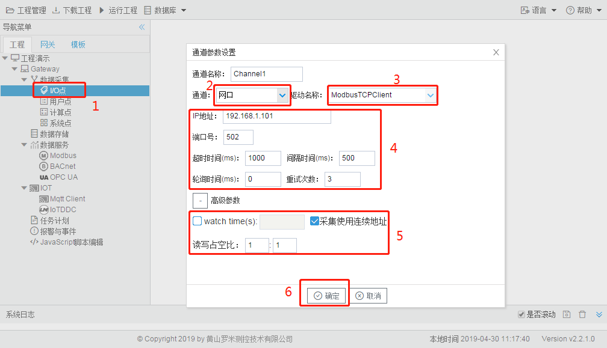
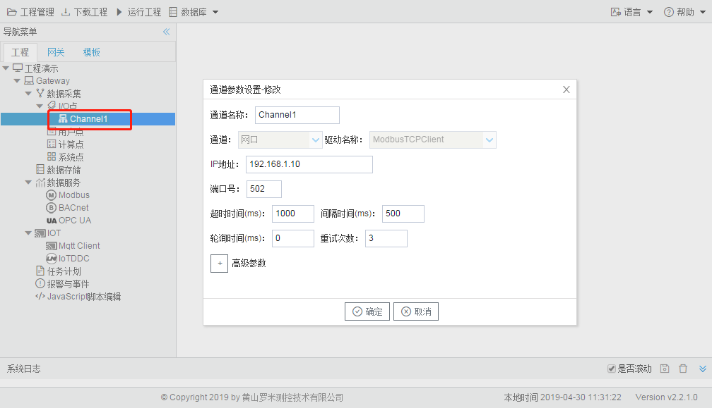

# 3.1 通道配置及协议选择

LMGateway网关支持串口、网口采集，可新增或修改通道参数。

## 3.1.1 新建通道

单击选中“I/O点”节点，右键单击选择“新建通道”，配置工具会根据“添加网关设备”时选择的网关型号显示可以添加的协议，在此我们选择“ModbusTCPClient”协议作为范例进行演示，如图2-1所示。 

图3-1 新建通道

在通道参数设备的弹出框中，进行从上往下的顺序配置，先设置在此网关设备中唯一的通道名称，之后根据上图的步骤进行配置： 

1. 根据需要配置的采集协议选择通道是串口还是网关； 
2. 进一步选择具体的协议； 
3. 配置协议的基本参数； 
4. 配置协议的高级参数； 

在每个协议的基本参数中都会包含超时时间、间隔时间、轮询时间和重试次数四项，含义如下： 

- 超时时间：网关等待设备响应的最长时间。当通信正常的情况下，设置 长一点不影响通信速度；假如设备响应速度比较慢，为了避免通信失败，建议可以设置长一点。 
- 间隔时间：网关接收到被采集设备返回的报文后等待间隔时间之后再发送下一组报文。 
- 轮询时间：当前通道中完成所有采集任务后，等待轮询时间，再进入下一次采集周期。 
- 重试次数：通讯失败后重新发送当前报文的次数。

通道配置界面根据协议的不同会判断是否显示高级参数的按键。如果基本参数不满足当前的应用场景，就需要设置高级参数，每种协议的高级参数也有所不同，如上图Modbus协议中高级参数为watch time、采集使用连续地址和读写占空比，含义如下： 

- watch time: 设备故障时间，在当前通道下的设备通讯不上时，在watch time间隔内，不会再采集这个设 备。 
- 采集使用连续地址：默认勾选，网关会根据配置的Modbus地址的连续性自行组成报文统一采集。 
- 读写占空比：用于控制写操作与读操作的比率。占空比的默认设置为 1：1，这意味着每次读取操作对应一 次写入操作。即使在应用程序执行大量的连续写入操作时，也必须确保足够的读取数据处理时间。如果将 占空比设置为 1：10，则每次读取操作对应十次写入操作。如果未执行任何写入操作，则会连续处理读取 操作。 

## 3.1.2 修改通道

选择需要修改的通道，双击即可弹出修改通道的窗口。如图2-2所示。

图3-2 修改通道

