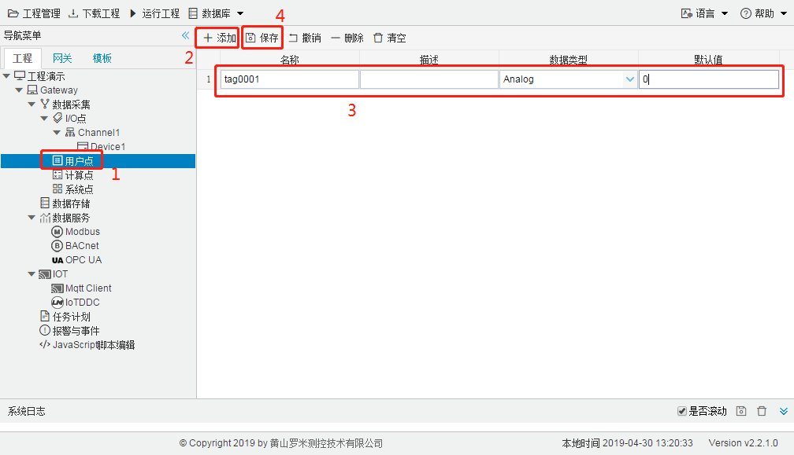

# 3.3 用户点

前面部分讲到实际数据采集I/O点的配置，但工程部署中还需要一些非实际I/O的点，这些点是用户可选可配，即用户点，这些用户点可用于JavaScript编程，可作为一个控制信号，也可作为一个运算结果的呈现。 

1. 单击工程树上的“用户点”节点。 
2. 点击“添加”按钮新增一个用户点。 
3. 输入用户点配置页面中唯一的名称，选择点类型（开关量或者模拟量），添加该点的默认值。 
4. 点击“保存”完成添加点。 

具体步骤如图3-5所示。

图3-5 添加用户点

