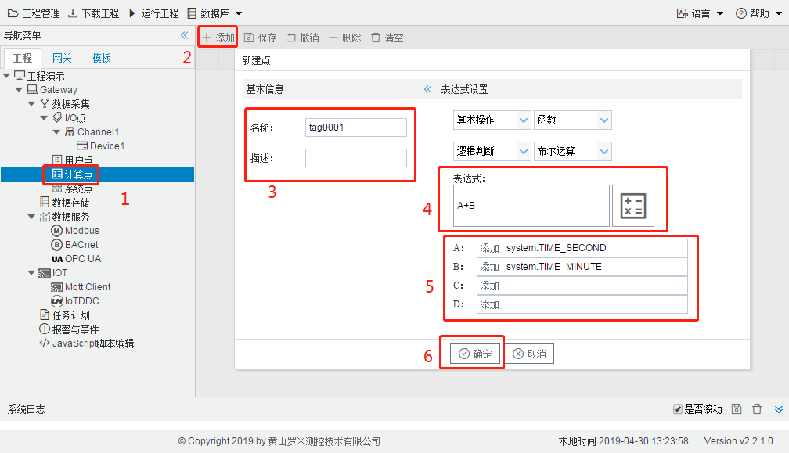

# 3.4 计算点

计算点是一种特殊的Tag点，它的值是某个表达式的计算结果，该表达式的参数可以是Tag点或常数，在表达式中 可以使用一些常用的计算方法，包括四则运算，逻辑运算，三角函数等。 

通过使用计算点，可以做一些相对复杂的计算，例如将采集到的传感器数值通过换算得到实际的物理量（如液 位、风速等），这样可以减少上位机的运算量，也使得设备更加智能化。 

每个计算点对应一个表达式，表达式可以有最多4个Tag点作为输入变量，为了方便起见，4个Tag点在表达式中分别使用A，B，C，D来表示。操作步骤如下： 

1. 单击工程树上的“计算点”节点。 
2. 点击“添加”按钮新增一个计算点。 
3. 输入计算点配置页面中唯一的名称。 
4. 输入计算表达式，表达式中可使用的预设函数或运算符可以从表达式输入框上方的几个下拉框中选择，也 可以手动输入预设的函数或运算符。 
5. 单击表达式变量的输入框左侧添加按钮，选择该变量对应的Tag点。 
6. 点击“确定”完成添加点。 

具体步骤如图3-6所示。

图3-6 添加计算点

