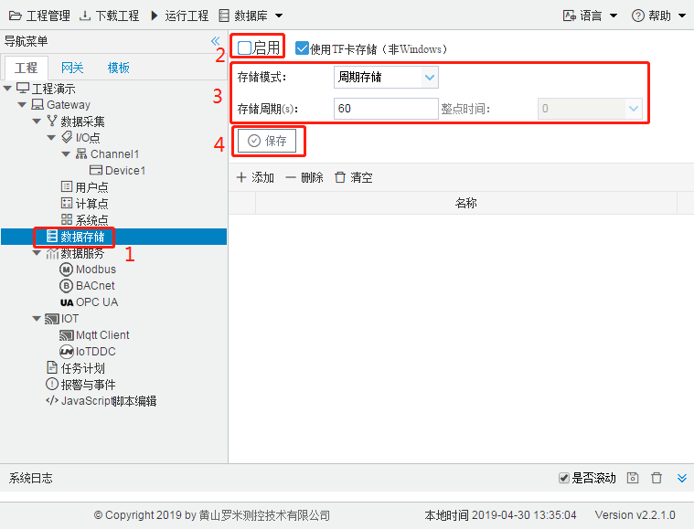

# 4.1 数据存储配置

开启数据存储功能，需要在数据存储页面进行相关的配置，操作步骤如下：

1. 单击“数据存储”节点，打开数据存储的配置页面； 
2. 勾选“启用”复选框； 
3. 选择存储模式：周期存储（需要设置存储周期）和准点存储（需要添加每天存储的整点时间）； 
4. 点击“保存”完成配置。 

如图4-1所示。

图4-1 数据存储配置

LMGateway网关的数据存储只能存储到TF卡当中，GC软件的数据存储会存储在安装目录的history文件夹。

