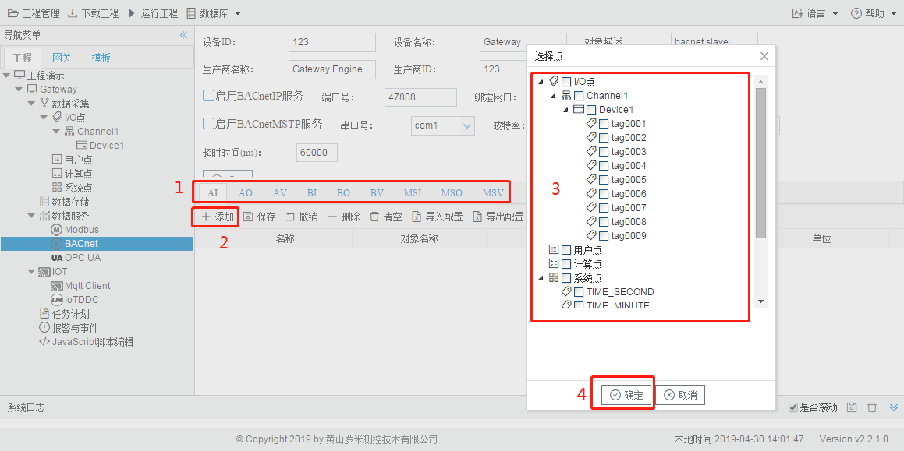
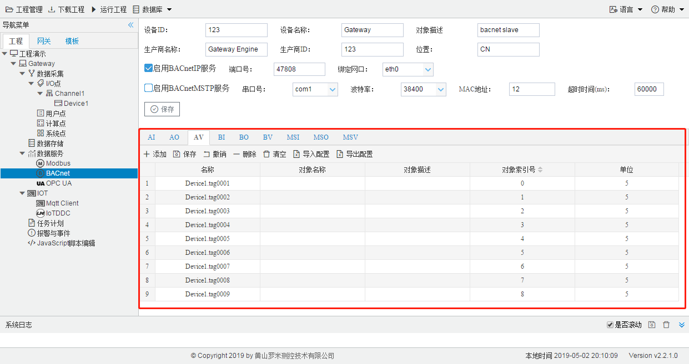
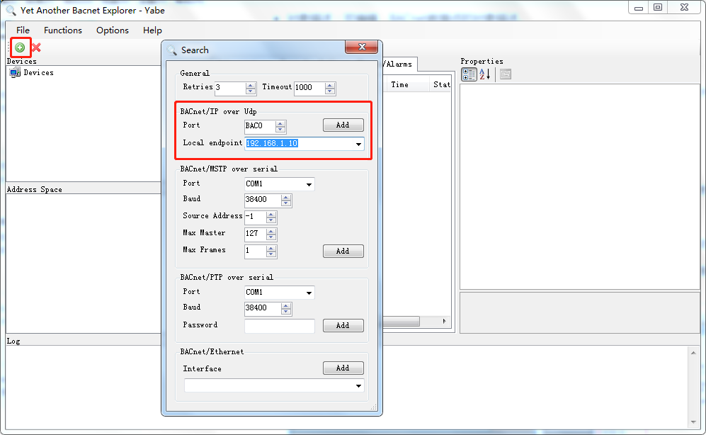
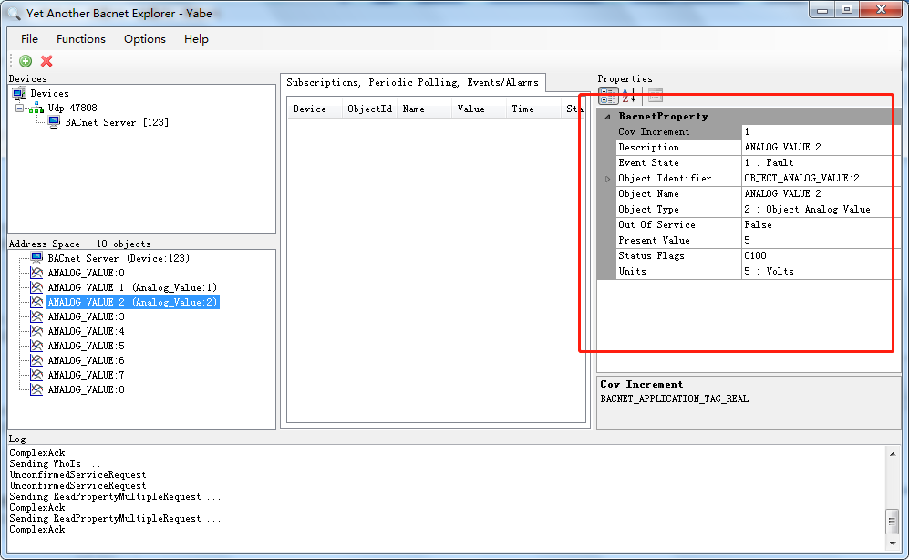

# 5.2 BACnet

用户通过勾选"启用BACnetIP服务"和"启用BACnetMSTP服务"选择需要启用的BACnet Service服务。 

BACnetIP服务默认端口为47808，通过绑定的网口进行数据交互。 

BACnetMSTP服务通过绑定的串口进行数据的交互。 

**BACnet地址映射** 

为了BACnet客户端可以访问到设备上的Tag点，需要将Tag点映射到对应的BACnet地址上，配置步骤如下： 

1. 选择需要映射的BaCnet上传表中的数据类型，目前的数据类型有AI,AO,AV,BI,BO,BV,MSI,MSO,MSV； 
2. 单击“添加”按钮； 
3. 在弹出的选择点窗口中勾选需要映射的点； 
4. 点击”确定“按钮完成映射点的添加。 

重复上述操作可添加更多的点到地址列表。 

图5-2 BACnet地址映射

双击Tag点可修改Tag点映射到BACnet地址的详细设定，可配置项有： 

- 对象名称：可编辑，BACnet数据点的对象名称。 
- 对象描述：可编辑，BACnet数据点的对象描述。 
- 对象索引号：必填项，与AI,AO,AV,BI,BO,BV组合为AI0，AI1，AI2等。 
- 单位：可编辑，通过下拉框选择。

MSI、MSO、MSV为多态，如果需要映射到BACnet的多态上，MSI、MSO、MSV的页面中“多态”列必须要有最少一个状态。 

用Yabe软件读取BACnetIP服务示例，步骤如下：

1. 此时已经在工程中进行了采集配置和BACnetIP服务配置，也在服务中进行了地址映射，图中将数据点映射到了AV当中，具体映射如下：

2. 将该工程通过工具栏中的“下载工程”按钮将工程下载到LMGateway当中，让网关自动运行当前工程。

3. 打开Yabe软件，点击上方工具栏的绿色“+”号按钮，在弹出框中上图中的端口号(BAC0为上图中47808的16进制)、选择PC的IP地址，点击“Add”完成软件连接配置。

   

4. 如果此时在Udp:47808节点下有GC中BACnet页面设备ID的设备，说明已经连接上LMGateway的BACnetIP服务，单击此设备节点，就会在左侧中部显示搜索到的所有此设备映射出的BACnet点。

   

5. 点击每一个点，就会显示该点的所有属性。

   