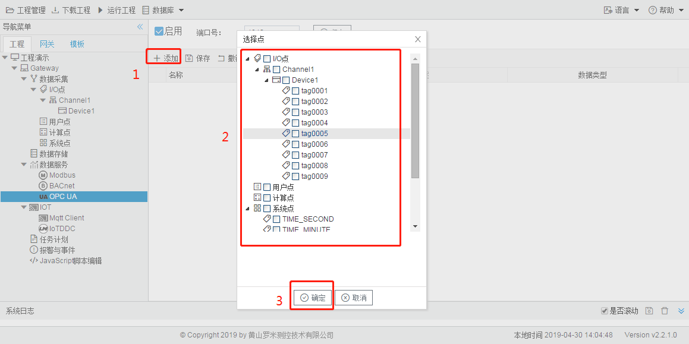
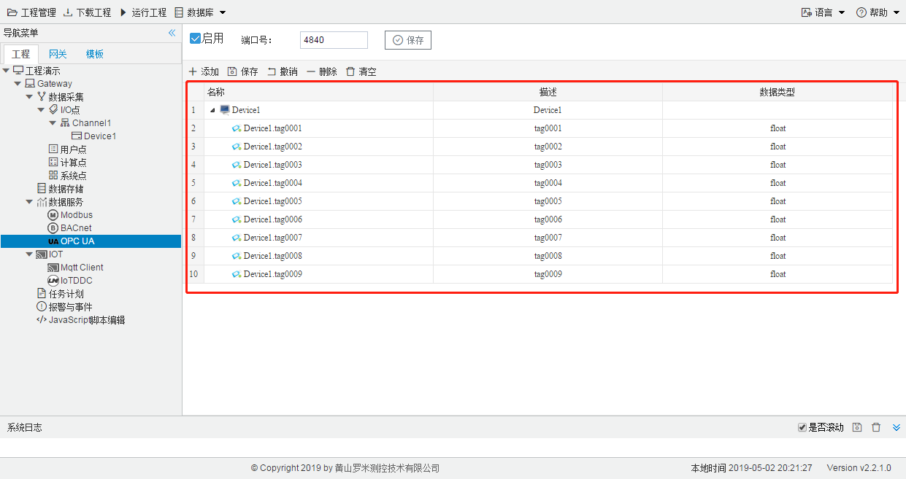
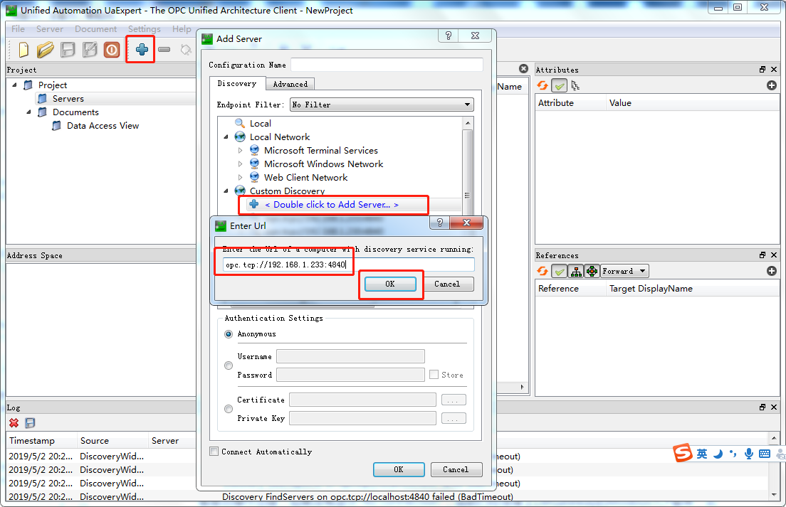
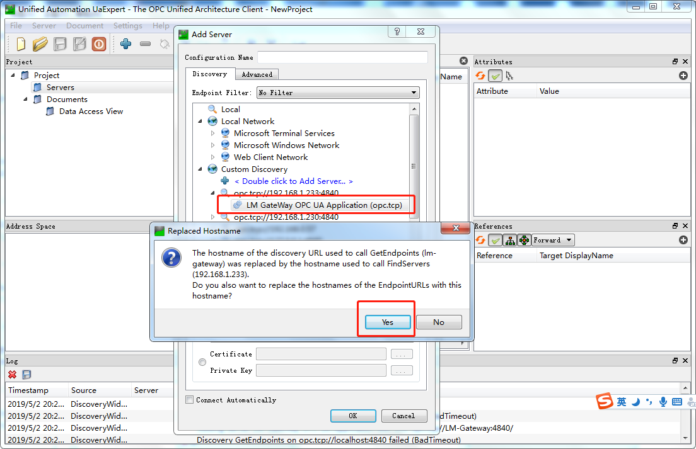
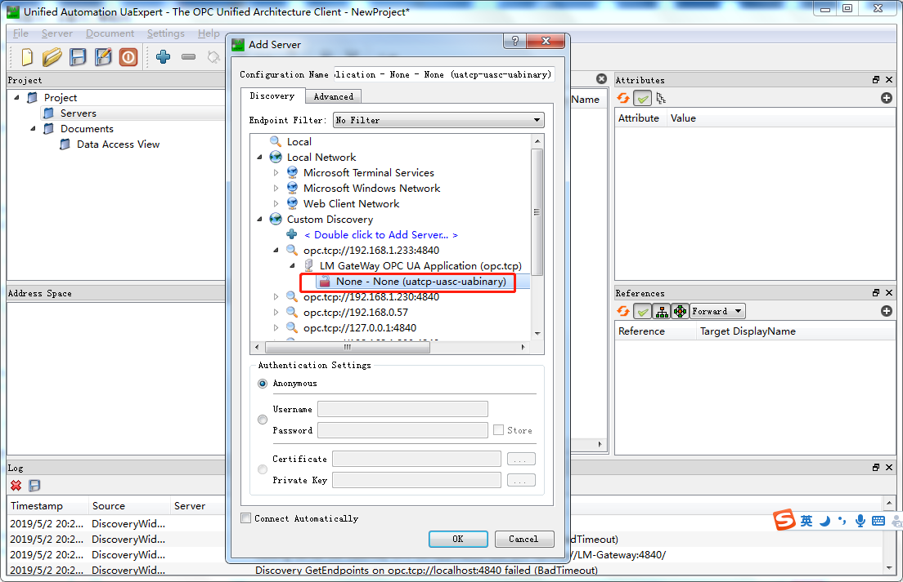
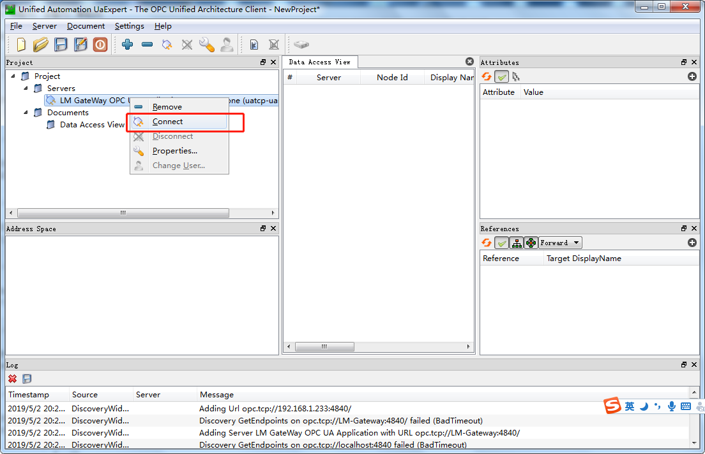
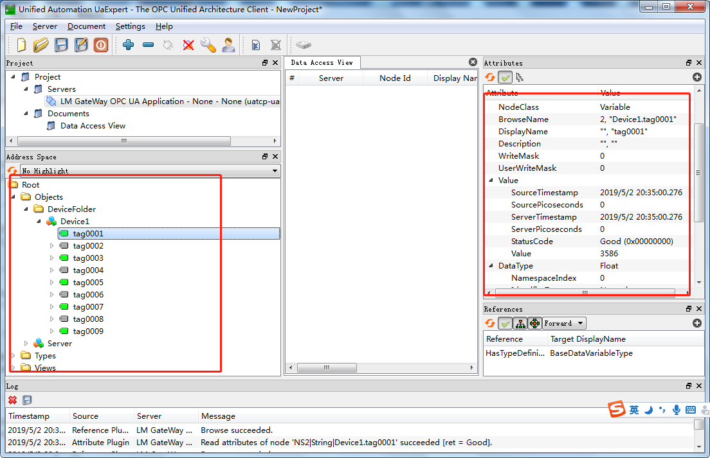

# 5.3 OPC UA

用户通过勾选"启用"和修改端口号来启动OPC UA服务。 

**OPC UA地址映射** 

为了OPC UA客户端可以访问到设备上的Tag点，需要将Tag点映射到对应的OPC UA地址上，配置步骤如下： 

1. 单击“添加”按钮； 
2. 在弹出的选择点窗口中勾选需要映射的点； 
3. 点击”确定“按钮完成映射点的添加。 

重复上述操作可添加更多的点到地址列表。 

图5-3 OPC UA地址映射

用UaExpert软件读取OPC UA服务示例，步骤如下：

1. 此时已经在工程中进行了采集配置和OPC UA服务配置，也在服务中进行了地址映射，具体映射如下：

2. 将该工程通过工具栏中的“下载工程”按钮将工程下载到LMGateway当中，让网关自动运行当前工程。

3. 打开UaExpert软件，点击上方工具栏中蓝色“+”号按钮，在弹出框中双击,输入LMGateway的IP地址和上图中的端口号，点击“OK”。

   

   双击上图添加的opc://192.168.1.233:4840节点下的子节点，在弹出框中点击"yes"。

   

   双击下图中的子节点

   

4. 此时在Servers下就会添加一个LM Gateway OPC UA节点，右键选择"Connect"。

   

5. 连接成功之后，就会在左侧显示所有的映射点，单击每个点就会在右侧显示该点的所有属性。

   