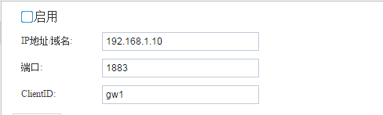
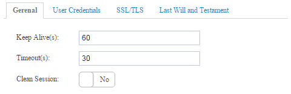
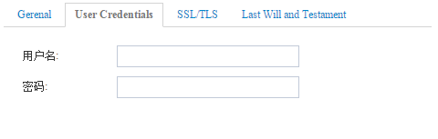
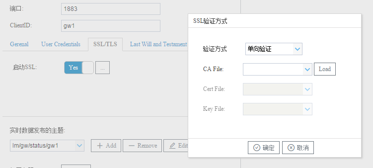
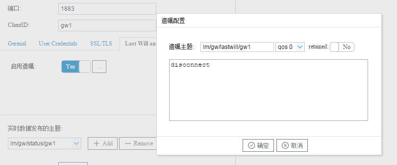
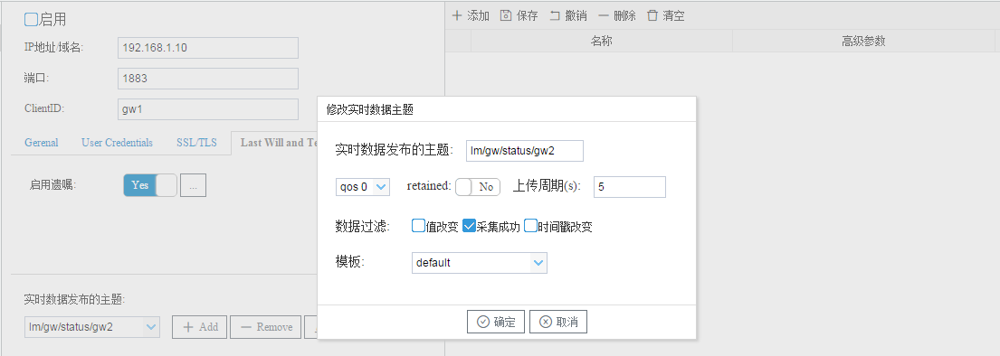
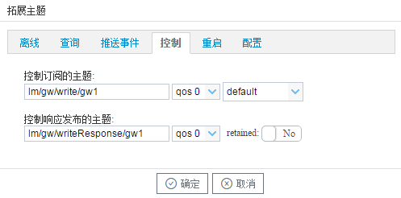

# 6.1 Mqtt Client

可用于配置与Mqtt服务器的连接。用户可以在Mqtt Client页面配置设备，让设备将tag点信息上传到IoT中心，同时支持不同主题、不同频率的上传。 

用户需要配置IoT中心连接属性、发布订阅的主题、需要上传的tag点等。 

## 6.1.1 基础连接属性

- 启用云服务，启用后网关设备才会进行MQTT的连接； 
- IP地址/域名、端口：网关设备需要连接的MQTT broker服务器的IP和端口号（默认1883）； 
- ClientID：客户端唯一标识，同一时间内 Server 和同一个 ClientID 只能保持一个 TCP 连接，如果重复ClientID连接会踢掉前一个。 



<center>图6-1 mqtt基础连接属性</center>


## 6.1.2 进阶连接属性

1. 基本配置（Gerenal） 

   - Keep Alive(s)：心跳，客户端在Connect的时候设置 Keep Alive 时长。如果服务端在 1.5 * KeepAlive 时间内没有收到客户端的报文，它必须断开客户端的网络连接，默认为60秒。 

   - Timeout(s)：定义客户端发送信息到云端响应的最大时间间隔，客户端超过时间没有得到相应后会主动中断连接，默认为30秒。 

   - Clean Session： 

     NO——开启会话重用机制。网络断开重连后，恢复之前的Session信息。需要客户端和服务器有 相关Session持久化机制。 

     YES——关闭会话重用机制。每次Connect都是一个新Session，会话仅持续和网络连接同样长的 时间。  



<center>图6-2 mqtt Gerenal </center>

2. 登录凭证（User Credentials）

   用户名和密码：根据服务器的配置来确定在mqtt连接时是否需要经过用户名和密码的验证。

   

   <center>图6-3 mqtt User Credentials </center>

3. 通信加密（SST/TLS）

   默认为不启用SSL安全连接，用户需要启用SSL时可以选择两种方式： 

   - 单向验证——需要上传CA文件到设备，当设备与云连接时，设备作为客户端提供证书供云服务商验证是否安全。CA文件由云服务商提供。 

   - 双向验证——需要上传CA文件、Cert文件、KEY文件到设备，当设备与云连接时，客户端与云端 均向对方提供证书，相互验证。 



<center>图6-4 mqtt User SSL/TLS </center>

4. 遗嘱配置（Last Will and Testament）

   默认不启用遗嘱，遗嘱是当网络连接关闭时，客户端必须发布这个遗嘱消息，所以被形象地称之为遗嘱， 

   可用于通知异常断线。启用遗嘱时需要设置遗嘱主题和遗嘱内容。

   

<center>图6-5 mqtt User Last Will and Testament </center>


## 6.1.3 发布、订阅主题配置

**实时数据发布主题：多主题、多频率、多格式上传** 

可通过增删改按钮对实时数据的主题进行操作，每个主题可以使用不同的主题配置、不同的上传频率、不同的数据过滤方式、不同的上传数据的模板等。添加的主题就会显示到实时主题下拉列表框中，选择下拉列表中一个主题然后通过右侧的“添加”按钮添加需要通过该主题上传的数据。



<center>图6-6 mqtt实时数据发布主题 </center>

如上图所示，每个实时数据主题都可以设置成不同的上传周期，不同的数据过滤方式，不同的上传数据的模板，如第一个实时数据主题可以为lm/gw/status/gw1,上传周期为10S，没有数据过滤，模板采用的是DCC；第二个实时数据主题可以为lm/gw/status/gw2,上传周期为5S，数据过滤选择“采集成功”，模板采用的是default。

**拓展主题**

- 离线数据发布的主题：网关在mqtt断线时，会根据上传的频率把数据存储在网关当中，在mqtt重连成功时会向离线数据的主题依次发送存储的数据。目前网关设备存储离线数据的容量为20M，当离线数据大于20M时，网关就会在存储新的离线数据时删除最早的离线数据。 查询数据的主题：在mqtt配置界面中“查询数据订阅的主题”一项输入需要订阅的主题，通过在mqtt服务器该主题上发布如下所示的格式的数据，即可实现查询数据的操作，网关会通过配置界面中“查询数据发布的主题”发布此次查询到的数据。 

  

```
{"operate":"read","devices":[
  {"deviceCode":"Device_1","tags":null}, 
  {"deviceCode":"Device_2",
  "tags":[
        {"tagCode":"tag0008"}
      ]
    }
  ]
} 
```


- 推送事件的主题：如果在“报警与事件”(1.12章节)当中配置了报警事件，当报警事件触发或者解除时网关设 备会保存该事件并且会通过推送事件的主题将该事件发布到云服务器。 

- 控制操作的主题：在mqtt配置界面中“写操作订阅的主题”一项输入需要订阅的主题，通过在mqtt服务器该主题上发布如下所示格式的数据，即可实现写入数据的操作。 

 

```
 [
   {
     "operate":"write","deviceCode":"Device_1",
     "tagCode":"tag0001", "val":"10"
   }
 ] 

```


  deviceCode：采集协议页面中的设备名称, 

  tagCode：数据点的名称； 

  val：需要写入的数值，字符串类型。 

- 重启网关的主题：在mqtt配置界面中“重启网关订阅的主题”一项输入需要订阅的主题，通过在mqtt服务器 该主题上发布如下所示的格式的数据，即可实现重启网关的操作。 

​      ` {"operate":"reboot"}`

- 配置网关的主题：通过云服务器将配置工具配置生成的数据库配置文件转换成二进制发布到配置网关的主题当中，实现远程配置网关。 



<center>图6-7 mqtt拓展主题 </center>

**高级参数** 

如果需要在mqtt上传的JSON格式当中添加一些自定义的字段，可以通过“高级参数”的字段和修改模板的方式达到要求。 

在Mqtt Client页面点击“添加”按钮添加了需要上传的Tag点之后，可以双击需要添加自定义字段的Tag点，在“高 级参数”字段中添加所需要的json键值对，如{"unit":"摄氏度"}，然后通过联系配置工具制作商修改模板，就可以把“unit”当成此Tag点的属性生成json然后通 过实时数据的主题上传。 


<center>图6-8 mqtt高级参数 </center>

