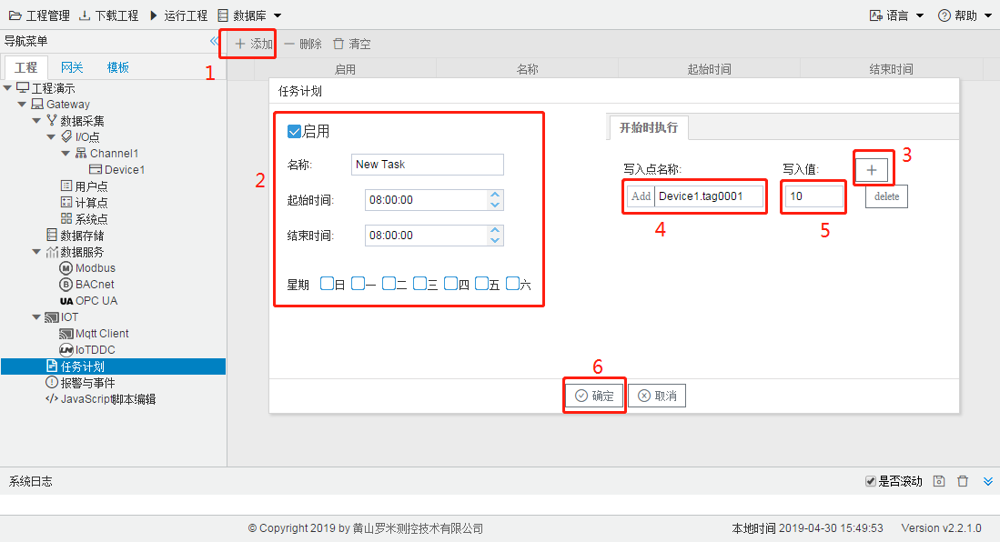

# 第七章 任务计划

LMGateway网关支持任务计划功能，用户通过建立任务计划，可以实现任意时刻设置多个点值的操作。具体操作如下： 

1. 单击“添加”按钮； 
2. 在弹出的编辑框中添加不重复的任务计划的名称、起始时间、结束时间和必须选中一星期中的某一天或几天，必须保证起始时间小于结束时间，在起始时间与结束时间范围内对设置的多个点值保持设置的值，如果发现采集的点值不是保持的值，则会发送写操作命令给采集驱动； 
3. 点击”+“按钮使之弹出新的Tag点添加文本框和写入值的文本框； 
4. 点击“Add”按钮，在弹出的“选择点”窗口中选择一个需要写入值的点； 
5. 在写入值的文本框中填入需要写入的值； 
6. 可重复3,4,5的步骤进行多点的写入； 
7. 点击”确定“按钮完成任务计划的添加。 

如图7-1所示。

图7-1 任务计划配置

如果想修改已经添加的任务计划，只需要双击需要修改的任务计划，就会弹出上图的任务计划的窗口。重复上述步骤完成任务计划的修改。