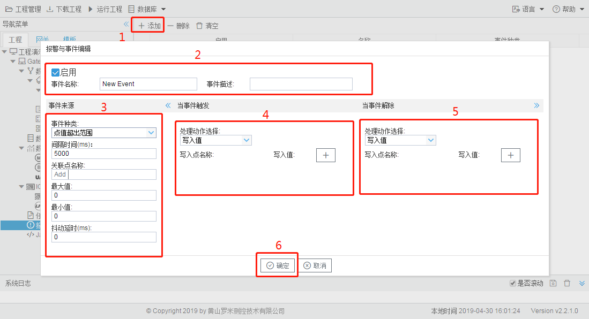

# 8.1 设置报警条件

报警与事件的根据报警条件分为“点值超出范围”和“质量不为Good”两种类型报警，用户可以根据具体的需要选择建立相应的报警事件，并且报警事件触发和报警事件恢复记录都会保存下来。

事件编辑步骤如下：

1.  单击“添加”按钮； 

2. 编辑唯一的事件名称； 

3. 通过选择“事件种类”进一步填写事件参数 

   - 间隔时间：每隔间隔时间判断一次关联点是否满足事件触发或解除的条件。 

   - 关联点名称：可以为I/O点、用户点、计算点和系统点中的其中一个点。 
   - 最大值、最小值：关联点的值的范围，最小值≤当前值≤最大值为正常情况，当最小值>当前值或者最大值<当前值都会触发报警。 
   - 抖动时间：当点值超过范围或质量不为good持续的时间小于抖动延时，此时不触发事件。 

4. 在“当事件触发”的窗体中添加事件触发时写入的点和值； 

5. 在“当事件解除”的窗体中添加事件解除时写入的点和值； 

6. 点击”确定“按钮完成事件的添加。

图8-1 事件编辑

