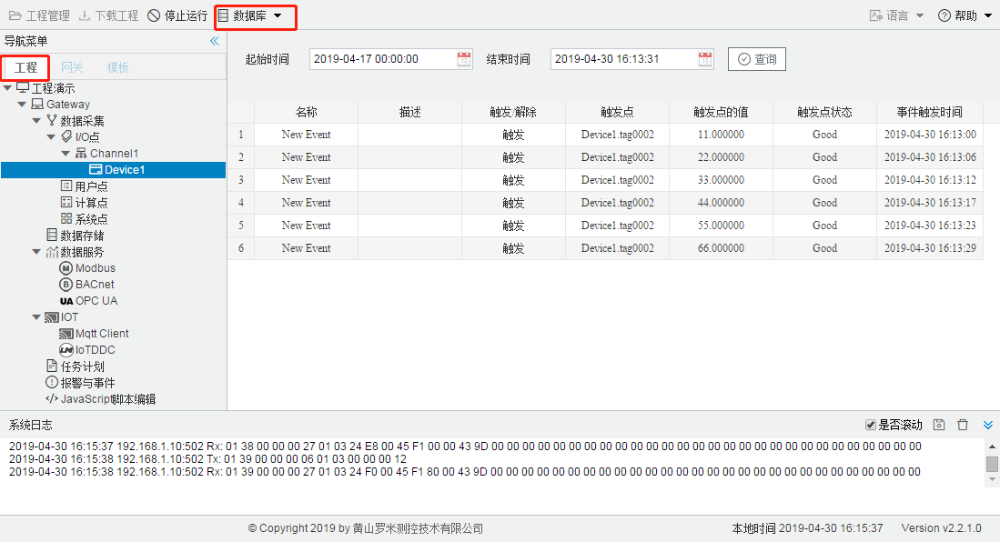
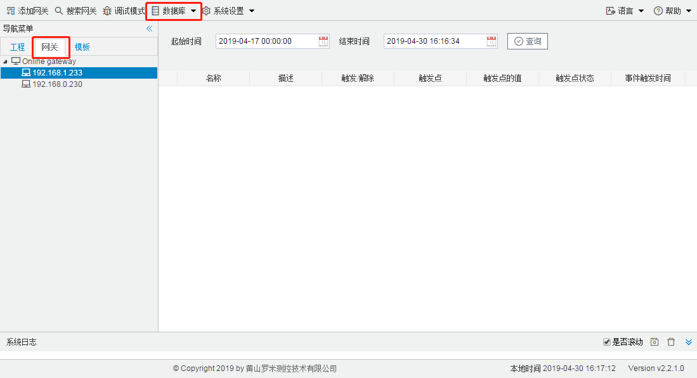

# 8.2 查询报警记录

GC或者网关运行工程时，如果触发/解除了事件报警，会将触发/解除的事件保存在数据库当中，在网关设备中数据库最大存储量为数据库文件大小限制为5MB，可以通过GC查询到报警的详细信息。

**查询GC运行产生的报警记录**

点击工具栏中“数据库”下拉列表中的查询报警记录，在弹出的子页面当中选择需要查询的报警记录的起始时间和结束时间，点击查询按钮，查询结果如图7-2所示。

图8-2 查询GC运行产生的报警记录

**查询LMGateway网关运行产生的报警记录**

 点击工具栏中“数据库”下拉列表中的查询报警记录，在弹出的子页面当中选择需要查询的报警记录的起始时间和结束时间，点击查询按钮，可以查询网关在时间段内所有的报警记录，查询结果如图7-3所示。

图8-3 查询LMGateway网关运行产生的报警记录

