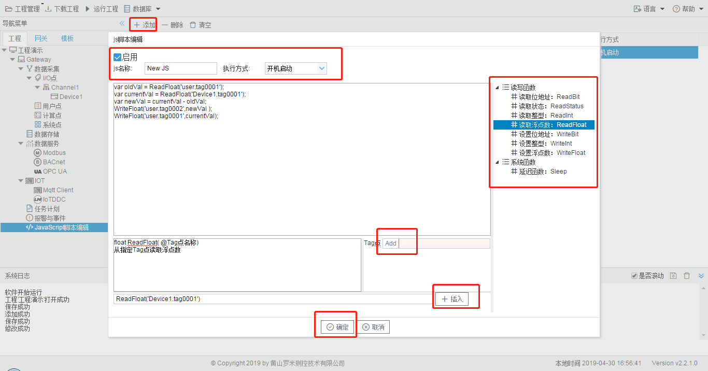

# 9.1 操作步骤

具体操作如下： 

1. 单击“添加”按钮； 
2. 在弹出的编辑框中添加唯一的js名称，执行方式总共有三种：开机运行、循环和定时三种方式运行。开机运行就是程序启动的时候就运行该JS脚本；循环运行就是根据配置的执行周期（ms）循环执行JS脚本，而定时执行就是在每天的规定的（时：分：秒）去执行JS脚本； 
3. 单击选中需要运行的函数； 
4. 点击“Add”按钮，在弹出的“选择点”窗口中选择一个需要读取或者设置的点； 
5. 单击“插入”按钮，将新建的函数添加到js编辑框的光标后面； 
6. 可重复3,4,5的步骤进行多个函数的添加； 
7. 点击”确定“按钮完成js脚本的编辑。

图9-1 JavaScript脚本编辑步骤

